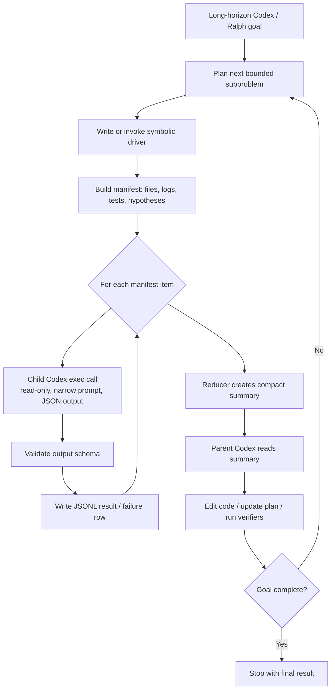

# Codex RLM Integration Conclusions

## Core Conclusion

RLM-style recursion should be integrated into Codex long-horizon work as a
bounded execution pattern, not as a replacement for the main Codex loop.

The main Codex or Ralph loop should keep responsibility for the goal, strategy,
final code edits, and verifier interpretation. A deterministic driver should own
the repeatable control flow: selecting tasks, looping, filtering, retrying,
caching, and writing compact artifacts. Child Codex calls should handle narrow
semantic leaf work and return machine-readable outputs.

In short:

- Parent Codex loop: decides what matters.
- Symbolic driver: decides how many calls happen, in what order, and under what
  limits.
- Child Codex calls: answer small read-only questions.
- Artifacts: preserve the full trace while keeping parent context compact.

## Simple Diagram



If Mermaid is unavailable, the same architecture is:

```text
Codex/Ralph goal loop
  -> bounded subproblem
    -> symbolic driver
      -> manifest of work items
        -> child codex exec calls
        -> schema validation
        -> JSONL results/failures
      -> compact reducer summary
  -> parent Codex acts on compact summary
  -> tests/verifiers decide whether to continue
```

## Where It Helps

This pattern is worth using when a task has broad fan-out, repeated structure,
or long-horizon memory pressure:

- repo mapping and module summaries;
- PR or diff review by file;
- failing test and log triage;
- migration planning across many call sites;
- verifier-driven repair loops;
- research over many docs, issues, or traces.

It is usually not worth using for a one-file edit, a single failing test, or a
small design question. In those cases, direct Codex work is cheaper and simpler.

## Recommended Runtime Shape

Use a run directory per long-horizon subproblem:

```text
rlm/runs/<run-id>/
  manifest.jsonl
  results.jsonl
  failures.jsonl
  summary.md
  state.json
```

The manifest is deterministic. The results are append-only. The summary is the
only artifact the parent Codex loop usually needs to read back into context.

Child calls should normally look like this:

```shell
codex exec \
  --ephemeral \
  --sandbox read-only \
  --cd /path/to/repo \
  -c 'model_reasoning_effort="low"' \
  -o /tmp/child-result.txt \
  "Read FILE. Output only JSON matching this schema. Do not modify files."
```

The parent can run with a stronger profile, including `ralph-loop` or `yolo`,
but child calls should remain read-only unless there is a deliberate reason to
allow writes.

## Guardrails

Use these defaults for reliable long-horizon loops:

1. Keep child calls narrow and read-only.
2. Require JSON or another machine-checked output contract.
3. Cache child results by file hash, prompt version, and model config.
4. Put timeouts and max-call budgets in the driver.
5. Store failures separately from successful results.
6. Let the parent Codex session apply final edits.
7. Summarize before re-entering parent context.

The point is to make the repeated computation programmatic while reserving the
main model's context for judgment, implementation, and verification.

## Practical Next Step

The current `rlm/codex_rlm_poc.py` proves the primitive: Python owns the loop and
Codex handles leaf calls. The next useful version should turn it into a small
runner with explicit workflows:

```text
rlm/
  runner.py
  workflows/
    repo_map.py
    test_triage.py
    pr_review.py
  runs/
```

That would make RLM-style recursion available as a normal tool inside Codex
long-horizon work: invoke a workflow, collect compact artifacts, then continue
the main goal loop with much less context pressure.
